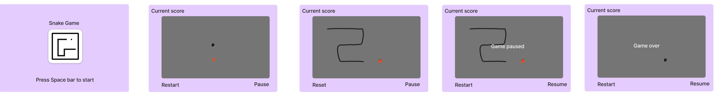

# Kiran's Classic Snake Game

This is the classic snake game we all used to enjoy as kids on our  nokia mobile phones. This is created using simple beginner friendly Java script code. 

## Game Description and Features

The game's logic is pretty simple Eat. Grow. Repeat. It is Easy to lean, hard to master and extremely addictive!

You’ll start each game with one green and one red square. The green square is your snake and the red is an apple. Move the snake around the screen and eat as many apples as you can until the screen is full of the snake’s body.

Each time an apple is eaten, the snake will grow. In the original Snake game, your snake’s body will grow by one square each time it eats.

### MVP Features
1. Welcome screen and game start screen.
4. Current score

## Game Rules

There are only two rules you must follow when playing: don’t hit a wall and don’t bite your own tail. Crashing into a wall or your tail will end the game immediately. Your high score is calculated based on the number of squares you added to the snake. 

## Game Wireframes

## Technologies used

HTML, CSS, JavaScript

## Game USer Stories 
1. As a user I want to click space bar or start to start the game
2. As a user I want to pause the game while playing
3. As a user resume the game which is paused
4. As a user I want to see what’s my current score while playing. 

###  Future Roadmap
1. Reset game
3. Pause / Resume game
2. Colour selection
3. Level selection with various difficulty.
4. Share button integration with whats app, twitter.
5. High score

## Contributing
Initial version created by : Kiran 